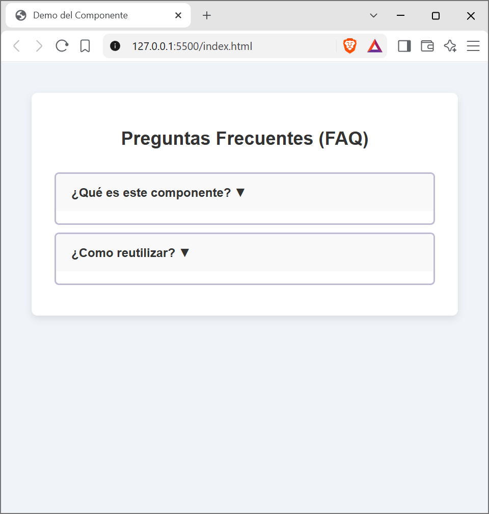
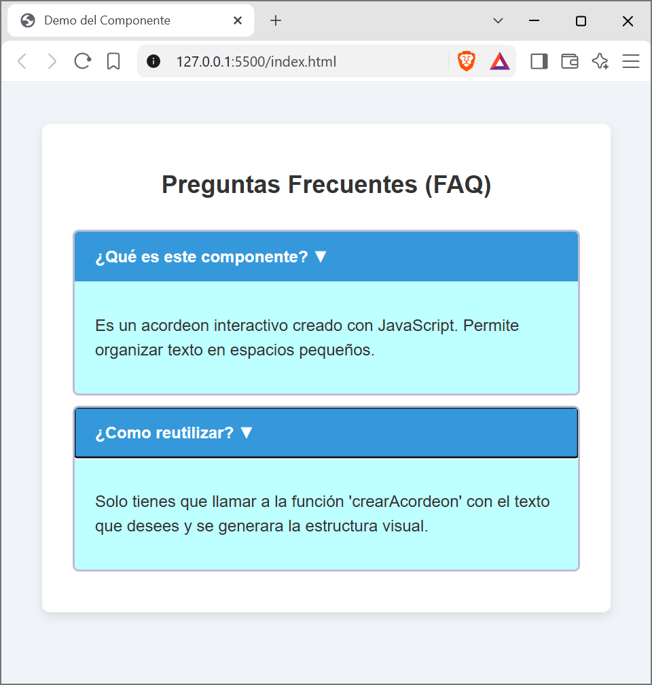

# Componente Visual: Acordeón Dinámico

## 1. Portada
* **Autor:** Irving Jose Perez Gris
* **Nombre del componente:** Acordeón interactivo
* **Materia:** Programación web
* **¿Qué problema resuelve?:** Cuando una página web tiene demasiado texto, el usuario tiene que hacer mucho *scroll*, lo cual resulta frustrante. Este componente resuelve ese problema ocultando la información y mostrándola cuando el usuario hace clic en el título que le interesa.

## 2. Instalación
Para usar este componente en cualquier proyecto, solo necesitas enlazar la hoja de estilos en el <head> y el script de JavaScript antes de cerrar el <body>:

```html
<!-- En el <head> -->
<link rel="stylesheet" href="css/componente.css">

<!-- Al final del <body> -->
<script src="js/componente.js"></script>
```

## 3. Uso y ejemplos de código
El componente es reutilizable. Solo necesitas colocar un contenedor vacío y llamar a la función en JavaScript, indicando el ID del contenedor, el título y el texto.

### Paso 1: Colocar el contenedor en tu HTML
```html
<div id="mi-contenedor"></div>
```

### Paso 2: Llamar al componente desde JavaScript
```javascript
// Sintaxis: crearAcordeon(id_del_contenedor, titulo, contenido);

crearAcordeon(
    "mi-contenedor", 
    "¿Es reutilizable?", 
    "Sí, puedes llamar a esta función 100 veces con textos diferentes y se crearán 100 acordeones independientes."
);
```

## 4. Capturas de pantalla




## 5. Video promocional
**Enlace al video:** [Video promocional](https://youtu.be/df105nG8-gY)

## 6. Enlaces del Proyecto

* **Repositorio del código:** https://github.com/IrvingJosePG/Componente-Visual-JS.git
* **Proyecto en línea (GitHub Pages):** https://irvingjosepg.github.io/Componente-Visual-JS/
